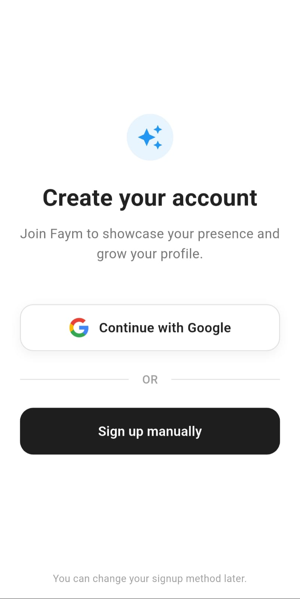
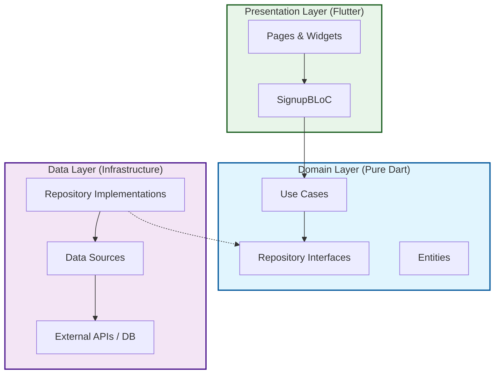

# Faym Signup Module

A modern, polished, and architecturally robust signup flow built with Flutter. This project demonstrates high-quality UI/UX design, strict Clean Architecture adherence, and scalable BLoC state management.

---

## 📸 Screenshots

| Role Selection | Manual Signup | User Details |
|:---:|:---:|:---:|
|  |  |  |

---

## 🏗 Architecture

This project strictly follows **Clean Architecture** principles to ensure separation of concerns, testability, and scalability. The code is divided into three main layers: **Domain**, **Data**, and **Presentation**.

### 1. Domain Layer (Inner Core)
The pure business logic layer. It has **zero dependencies** on Flutter, external libraries, or specific data sources.
-   **Entities**: Pure Dart objects representing the core business data (e.g., `UserEntity`).
-   **Use Cases**: Encapsulate specific business rules (e.g., `GoogleSignupUseCase`, `ManualSignupUseCase`).
-   **Repositories (Interfaces)**: Abstract definitions of how data should be handled, implemented by the Data layer.

### 2. Data Layer (The Output)
Responsible for retrieving and managing data from external sources (APIs, Databases, etc.).
-   **Data Sources**: Low-level implementations that talk to specific APIs (e.g., `GoogleSignupDataSource` using `google_sign_in`, `ManualSignupDataSource`).
-   **Repositories (Implementation)**: Concrete implementations of the Domain repositories. They act as mediators, fetching data from data sources and mapping it to Domain entities.

### 3. Presentation Layer ( The UI)
The visible part of the application, responsible for rendering the UI and handling user interactions.
-   **BLoC (Business Logic Component)**: Manages the state of the UI. It receives **Events**, executes logical operations (via Use Cases), and emits **States** (e.g., `SignupLoading`, `SignupSuccess`).
-   **Pages & Widgets**: The visual components constructed with Flutter widgets.

---

## 🧩 Architecture Diagram



---

## 🛠 Tech Stack & Packages

| Package | Version | Purpose |
| :--- | :--- | :--- |
| **flutter_bloc** | `^8.1.4` | State management using the BLoC pattern. |
| **get_it** | `^8.0.3` | Service Locator for Dependency Injection (DI). |
| **google_sign_in** | `^6.2.2` | Handling Google Authentication flow. |
| **equatable** | `^2.0.7` | Value equality for efficient state comparison in BLoC. |
| **dartz** | `^0.10.1` | Functional programming (Either type) for error handling. |
| **rxdart** | `^0.28.0` | Reactive programming extensions (optional use). |
| **cupertino_icons** | `^1.0.8` | iOS style icons. |

---

## 📂 Folder Structure

```
lib/
├── core/
│   ├── di/                 # Dependency Injection setup (get_it)
│   └── error/              # Custom Failures and Exceptions
├── features/
│   └── signup/
│       ├── data/
│       │   ├── datasources/    # Remote/Local data sources
│       │   └── repositories/   # Repository implementations
│       ├── domain/
│       │   ├── entities/       # Core business objects
│       │   ├── repositories/   # Abstract repository contracts
│       │   └── usecases/       # Business logic units
│       └── presentation/
│           ├── bloc/           # State management logic
│           ├── pages/          # Full screen pages (Scaffolds)
│           └── widgets/        # Reusable UI components
└── main.dart                   # Entry point
```

---

## ✨ Key Features

### 1. Modern UI/UX
-   **Swipe-to-Confirm**: A custom, interactive swipe button for manual signup validation.
-   **Card-Based Design**: Clean, grouped information layout using card metaphors and shadows.
-   **Responsive**: Adaptive layout handling `SafeArea` and scrollable content.

### 2. Robust State Management
-   **BLoC Pattern**: Predictable state transitions (`Initial` -> `Loading` -> `Success` / `Failure`).
-   **Separation of Concerns**: UI code does not contain business logic; it simply dispatches events.

### 3. Dependency Injection
-   **GetIt**: All dependencies (Use Cases, Repositories, Data Sources, External Libraries) are lazily loaded and injected, making the app highly testable and loosely coupled.

### 4. Mock Authenticated Session
### 4. Mock Authenticated Session
-   **Logout Capability**: Fully functional "Mock Logout" that clears the navigation stack and signs out of Google (if applicable), mimicking a real-world auth session life cycle.

---

## 🔐 Setup & Security

This project uses `flutter_dotenv` to manage sensitive configuration like the Google Client ID.

### 1. Environment Variables
1.  Copy the example environment file:
    ```bash
    cp .env.example .env
    ```
2.  Open `.env` and add your Google Client ID:
    ```
    GOOGLE_CLIENT_ID=your-client-id-from-gcp.apps.googleusercontent.com
    ```

> **Note**: The `.env` file is git-ignored to prevent accidental exposure of your credentials.

### 2. Web Configuration
The `google_sign_in` package on Web requires the Client ID to be configured either in `index.html` or passed to the constructor. For better security and flexibility, we inject it via Dart code:
```dart
// lib/core/di/injection_container.dart
sl.registerLazySingleton<GoogleSignIn>(
  () => GoogleSignIn(clientId: dotenv.env['GOOGLE_CLIENT_ID']),
);
```
Ensure you have the correct Client ID configured in your [Google Cloud Console](https://console.cloud.google.com/) for Web applications.
